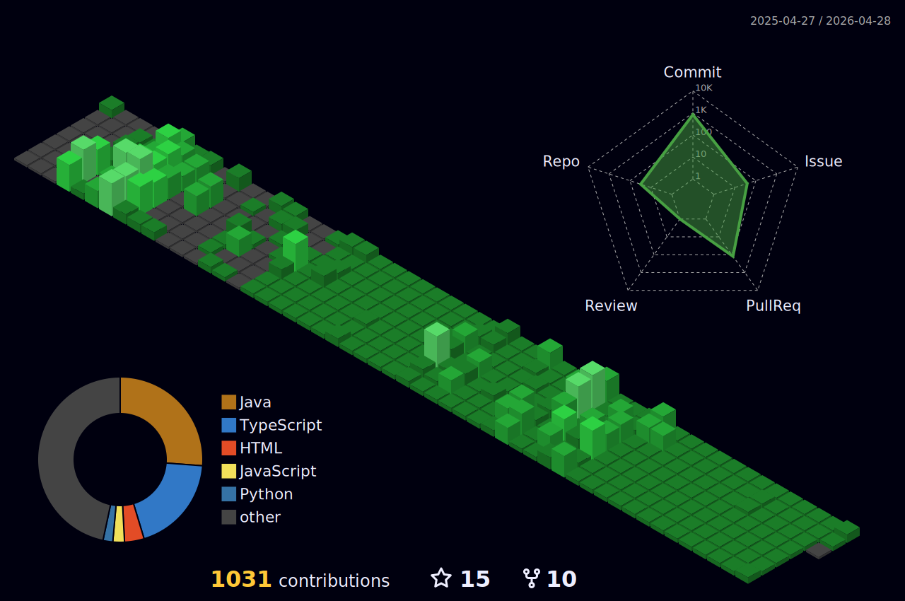

  

<!--
<h3 align="center">  

-->

  
# Hi there👋, I'm An

## 💫 About me

###### I'm a Hedspi student of SoICT-HUST

- 🌱 I’m currently learning **Full-stack Web Development**
- 👀 I’m interested in programming, video games, manga, anime, and more...
- 🎯 Goal: I aim to solve real, practical problems in everyday life
- 📫 How to reach me <An.LT235631@sis.hust.edu.vn>
- 😄 Pronouns: he/him

## 🌐 Connect with me

## 🛠️ Tech Stack & Skills

### 💻 Programming Languages

### 🔧 Frameworks & Libraries

 
 

### 🗄️ Databases

### 🐳 DevOps & Tools

 

### 🛡️ Others

---

<!---
lethanhan01/lethanhan01 is a ✨ special ✨ repository because its `README.md` (this file) appears on your GitHub profile.
You can click the Preview link to take a look at your changes.
--->
## 📊 Github Stats

  
  

## 🏆 GitHub Trophies 
 

## 📆 Github Contribution Graph
 

## 📈 GitHub Activity Graph

  <!-- dark snake -->
  

  

## ✍️ Dev Quote
<h3 align="center"> 

 

## Profile Views

 Counting of visitors to this page in this section started from September 2, 2025

