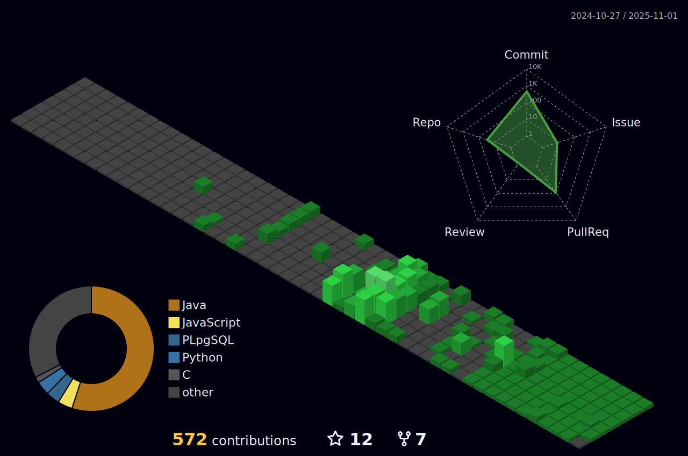

<h1 align="center"> Hi 👋, I'm An</h1>

<h3 align="center"> 

# 💫 About me

###### I'm a Hedspi student of SoICT-HUST

- 🌱 I’m currently learning **Full-stack Web Development**
- 👀 I’m interested in video games, manga,...
- 📫 How to reach me <An.LT235631@sis.hust.edu.vn>
- 😄 Pronouns: he/him

### 🌐 Connect with me

# 💻 Languages and Tools

 
 

 

 
<!---
lethanhan01/lethanhan01 is a ✨ special ✨ repository because its `README.md` (this file) appears on your GitHub profile.
You can click the Preview link to take a look at your changes.
--->
# 📊 Github Stats
 

  
  

  

## 🏆 GitHub Trophies 
 
---
## 📆 Github Contribution Graph
 
---
## 📈 GitHub Activity Graph
<!-- dark snake -->

## ✍️ Dev Quote
<h3 align="center"> 

 

## Profile Views

 Counting of visitors to this page in this section started from September 2, 2025

 

